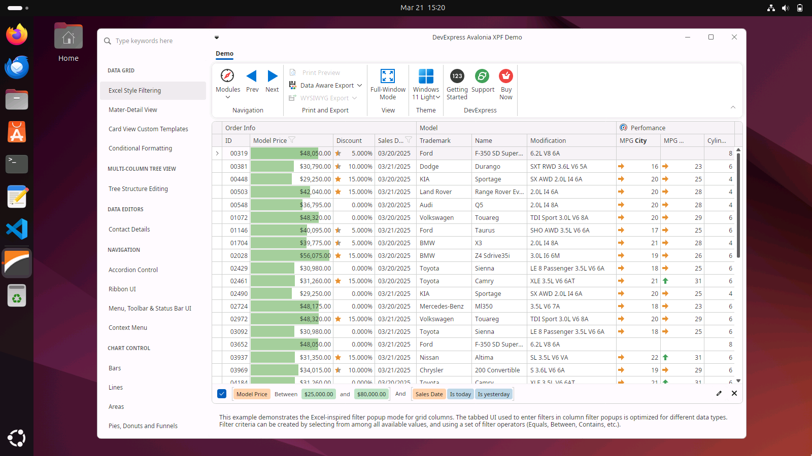

<!-- default badges list -->

[](https://supportcenter.devexpress.com/ticket/details/T1291621)
[](https://docs.devexpress.com/GeneralInformation/403183)
[](#does-this-example-address-your-development-requirementsobjectives)
<!-- default badges end -->

# DevExpress Avalonia XPF Demo

With [Avalonia XPF](https://docs.avaloniaui.net/xpf/welcome), your DevExpress-powered WPF projects can run on macOS and Linux. This demo uses Avalonia to handle DevExpress WPF API calls. To determine suitability, run the executables listed in the *Releases* section of this readme.




## Important considerations

- **Avalonia XPF was not developed by DevExpress**. Support for DevExpress controls is managed by the Avalonia Team. For information on current limitations, please refer to the following: [Supported DevExpress Components](https://avaloniaui.net/xpf/packages/devexpress).
- **Avalonia XPF is not Avalonia UI**. Avalonia UI is a different app framework (for ground-up cross-platform app development). DevExpress components do not support Avalonia UI.

## How to Run

Download pre-built installation packages for macOS and Ubuntu/Debian Linux by navigating to the Releases section.

**macOS**

To install this demo on macOS, download *AvaloniaXpfDemo-x64.zip* or *AvaloniaXpfDemo-arm64.zip*, unpack it, and move the installation file to the Applications folder.

**Ubuntu/Debian Linux**

Before you install the *AvaloniaXpfDemo* app on Ubuntu/Debian Linux, make certain that the following Avalonia XPF dependencies are installed: libice6, libsm6, libfontconfig1, and libgdiplus.

The following command installs all required packages on Ubuntu/Debian Linux:

`sudo apt install libice6 libsm6 libfontconfig1 libgdiplus`  

Refer to the following Avalonia XPF topic for additional information: [Linux Dependencies](https://docs.avaloniaui.net/xpf/platforms/linux#other-dependencies).

To install the AvaloniaXpfDemo app, download the *AvaloniaXpfDemo_1.0.0_amd64.deb* package and run the following command:

`sudo apt install ./path/to/AvaloniaXpfDemo_1.0.0_amd64.deb`

To uninstall: 

`sudo apt remove avaloniaxpfdemo`

## How to build

You need an [Avalonia XPF](https://docs.avaloniaui.net/xpf/welcome) license to build the demo project.

### Prerequisites

1. DevExpress subscriptions do not include an Avalonia XPF license. You need to purchase the license directly from Avalonia. Refer to the following page for additional information: [Avalonia XPF](https://docs.avaloniaui.net/xpf/welcome).

2. **macOS**: .NET 8 or higher is required.

3. **Linux**: .NET version installed (.NET 8 or higher) must include the **Microsoft.NET.Sdk.WindowsDesktop** SDK. Refer to the following tutorial for additional information: [.NET manual installation guide](https://learn.microsoft.com/en-us/dotnet/core/install/linux-scripted-manual#manual-install).

## Project Structure

The repository includes 2 DevExpress WPF-powered projects:

* [AvaloniaXpfDemo.Wpf.csproj](CS\AvaloniaXpfDemo\AvaloniaXpfDemo.Wpf.csproj) - A standard WPF project targeting Microsoft Windows.
* [AvaloniaXpfDemo.Xpf.csproj](CS\AvaloniaXpfDemo\AvaloniaXpfDemo.Xpf.csproj) - A cross-platform application built with Avalonia XPF (for macOS and Linux).

Both projects share common code files.

Some features are not supported in Avalonia XPF; see DemoRestrictions.cs for additional information.

## License Configuration

To configure the Avalonia XPF license, open the nuget.config file and replace the placeholder (<YOUR_LICENSE_KEY>) with your license key:

```xml
<configuration>
  <packageSources>
    <add key="xpf" value="https://xpf-nuget-feed.avaloniaui.net/v3/index.json" />
    <add key="avalonia-nightly" value="https://nuget-feed-all.avaloniaui.net/v3/index.json" />
  </packageSources>
  <packageSourceCredentials>
    <xpf>
      <add key="Username" value="license" />
      <add key="ClearTextPassword" value="<YOUR_LICENSE_KEY>" />
    </xpf>
  </packageSourceCredentials>
</configuration>
```

Update the identical placeholder in the [AvaloniaXpfDemo.Xpf.csproj](CS\AvaloniaXpfDemo\AvaloniaXpfDemo.Xpf.csproj):

```xml
<Project>
    ...
    <ItemGroup>
        <RuntimeHostConfigurationOption Include="AvaloniaUI.Xpf.LicenseKey" Value="<YOUR_LICENSE_KEY>" />
    </ItemGroup>
    ...
</Project>
```
## Build the Project

Once license information is configured, you can build the [AvaloniaXpfDemo.Xpf.csproj](CS\AvaloniaXpfDemo\AvaloniaXpfDemo.Xpf.csproj) project.

To build the project on Linux, follow the [Avalonia XPF Linux guide](https://docs.avaloniaui.net/xpf/platforms/linux).

## Known issues

* **[Linux]** Installed application crashes after closing.
* **[MacOS]** Cannot resize the application window.
* **[MacOS, Linux]** DataGrid: column resize operations do not work.
* **[Linux]** DataGrid: column drag drop - Drop Indicator (arrows) may be displayed at incorrect positions.
* **[MacOS]** DataGrid: column drag drop – limited functionality.
* **[MacOS, Linux]** DXTabControl: tabs are cropped after scroll operations (see Chart Control demos).
* **[MacOS, Linux]** PivotGrid: `NotImplementedException` on click.

<!-- feedback -->
## Does this example address your development requirements/objectives?

[](https://www.devexpress.com/support/examples/survey.xml?utm_source=github&utm_campaign=wpf-avalonia-xpf-demo-app&~~~was_helpful=yes) [](https://www.devexpress.com/support/examples/survey.xml?utm_source=github&utm_campaign=wpf-avalonia-xpf-demo-app&~~~was_helpful=no)

(you will be redirected to DevExpress.com to submit your response)
<!-- feedback end -->
